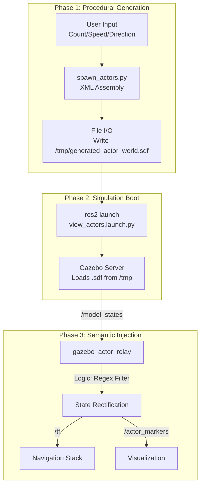

# Appendix D: Software Artifact - Procedural Generation & Semantic Injection

## 1. Problem-Solution Statement

**The Problem: Ontological Bias in Simulation**
In standard Gazebo simulations, animated actors (such as pedestrians) suffer from an "ontological bias": they exist as visual meshes within the rendering engine but lack the semantic properties required for robotic interaction. Furthermore, Gazebo Classic lacks a robust API for dynamically spawning these complex animated meshes at runtime via standard ROS services. Consequently, they function as "ghosts"—visible to the human eye but invisible to the robot's sensors—and are difficult to configure programmatically for batch testing.

**The Solution: A Two-Stage Pipeline**
To resolve this, the software implements a two-stage pipeline:
1.  **Procedural World Generation:** A "Generate & Reload" workflow that constructs a transient simulation world file in memory, injecting user-defined actor trajectories before the physics engine boots.
2.  **Semantic Injection Layer:** A runtime relay that intercepts the raw ground-truth state of the simulation, filters for actors, and rebroadcasts them as navigation-compatible entities (TF frames and Markers).

## 2. System Architecture

The following diagram illustrates the complete data flow, from user configuration to runtime visualization.



## 3. Algorithmic Implementation ("The Secret Sauce")

The system's efficacy relies on two distinct algorithmic components: the procedural generation of the simulation environment and the runtime semantic injection.

### 3.1 Procedural World Generation ("Generate & Reload")

To circumvent the limitations of Gazebo Classic's dynamic spawning API for animated actors, the system employs a "Generate & Reload" pattern. Instead of spawning entities into a running simulation, the software procedurally assembles a complete SDF world file in memory and boots the simulation with this transient asset.

**Snippet A (XML Injection)**
The script aggregates user inputs to construct the SDF (Simulation Description Format) content programmatically, injecting the actor tags directly into the world definition via string interpolation.

```python
# From spawn_actors.py
sdf_content = f"""<?xml version="1.0" ?>
<sdf version="1.6">
  <world name="actor_world">
    ...
    {joined_actors}  <-- Dynamic Actor Injection
  </world>
</sdf>
"""
```

**Snippet B (Transient File Execution)**
The generated content is written to a temporary location, and the simulation is launched pointing specifically to this ephemeral file.

```python
# From spawn_actors.py
temp_world_path = "/tmp/generated_actor_world.sdf"
with open(temp_world_path, 'w') as f:
    f.write(sdf_content)

# Launch Gazebo with the generated world
cmd = [
    "ros2", "launch", "gazebo_actor_spawner", "view_actors.launch.py",
    f"world_path:={temp_world_path}"
]
subprocess.run(cmd, check=True, env=os.environ)
```

### 3.2 Semantic Injection Layer

Once the simulation is running, the relay node performs the semantic translation required for ROS 2 integration.

**Snippet C (Semantic Filtration)**
The system iterates through the high-frequency `/model_states` topic, applying a regex filter to isolate actors of interest (e.g., those prefixed with "human"). This prevents the system from broadcasting irrelevant simulation objects (like ground planes or the sun) as dynamic obstacles.

```python
# From gazebo_actor_relay.py
self.actor_regex = re.compile(r"human_.*")

# ... inside callback ...
for actor_name in name_to_index.keys():
    if not self.actor_regex.match(actor_name):
        continue
```

**Snippet B (Planar Constraint/Quaternion Zeroing)**
To correct for artifacts where actors appear to "slide" or "lie down" due to animation frame mismatches or physics engine quirks, the system enforces a planar constraint. The orientation is locked to the World Z-axis (identity quaternion) for the visualization markers, ensuring a consistent upright representation in the operator's view.

```python
# From gazebo_actor_relay.py
# ORIENTATION: Force Upright (Identity Quaternion)
marker.pose.orientation.x = 0.0
marker.pose.orientation.y = 0.0
marker.pose.orientation.z = 0.0
marker.pose.orientation.w = 1.0
```

## 4. Visual Validation (Proof of Life)

The following figure demonstrates the successful injection of semantic data.

| Gazebo Classic (Source) | RViz2 (Visualization) |
| :---: | :---: |
| !Gazebo View | !RViz View |

*Figure D.1: Visual validation of the semantic injection layer. Left: The raw actor in the physics engine (invisible to sensors). Right: The semantic transformation into a tracked entity in RViz, enabled by the relay node.*