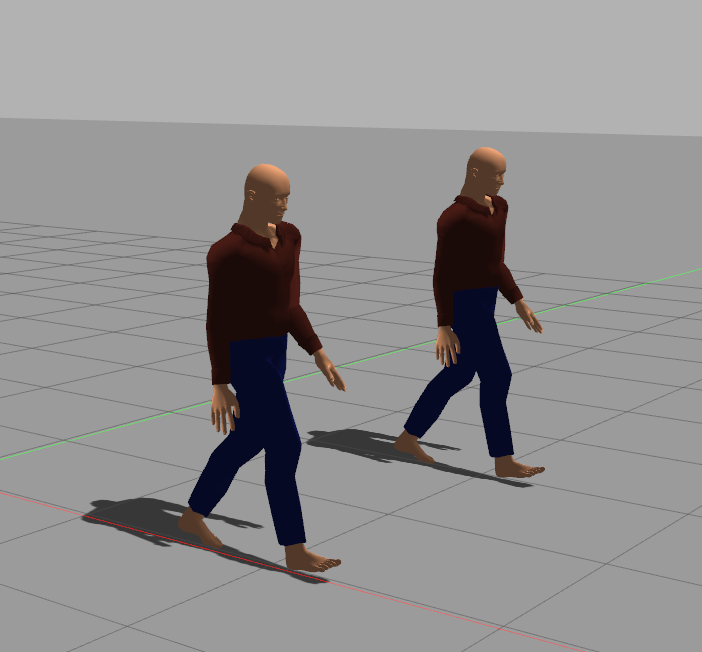
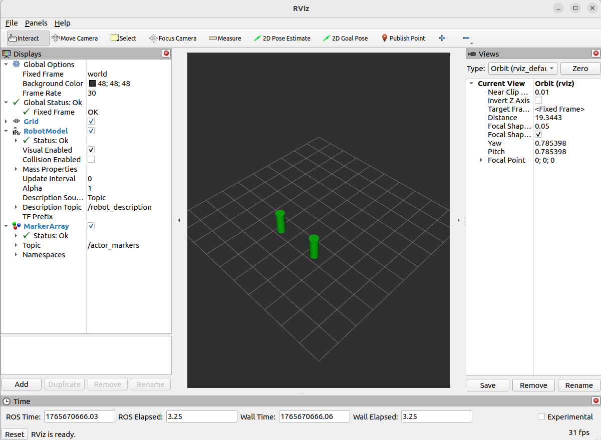

# gazebo_actor_relay
> Bridging Gazebo Classic actors into RViz2 with live markers and TF updates.

 

## Gallery
| Gazebo Classic (Source) | RViz2 (Visualization) |
| :---: | :---: |
|  |  |
> *Left: Animated actors in Gazebo. Right: The same actors rendered as dynamic cylinders in RViz.*

## Overview
Gazebo Classic can spawn animated humans, but RViz2 has no native way to render those actors or follow their transforms. `gazebo_actor_relay` closes that gap by listening to `/model_states`, filtering out `human_*` actors, and publishing both visualization markers and TF transforms. This allows operators to visualize pedestrian traffic and obstacles in RViz just like any other robot component.

## Key Features
- **Dynamic Visuals** – Every actor is rendered as an easily visible **green cylinder**, ensuring high contrast against map data.
- **Velocity-Based Scaling** – Marker height provides immediate visual feedback on speed. Stationary actors appear as 1.0 m markers, while moving actors grow taller based on velocity (`height = sqrt(vx^2 + vy^2)`), allowing operators to instinctively gauge motion in the costmap.
- **Orientation Locking** – Forces marker orientation to align with the World Z-axis, correcting the common simulation bug where actors appear to "lay down" or slide horizontally.
- **TF Broadcasting** – Publishes a dedicated TF frame for every actor (using the actor's name, e.g., `human_1`) so planners and perception nodes can track them directly.

## Architecture
| Stage | Description |
| --- | --- |
| **Input** | `/model_states` (`gazebo_msgs/ModelStates`) from Gazebo Classic |
| **Logic** | Regex filter (`human_*`) → planar velocity magnitude → marker + TF construction |
| **Output** | `/actor_markers` (`visualization_msgs/MarkerArray`) for RViz plus `/tf` transforms |

## Installation & Build
```bash
# From your ROS 2 workspace
cd ~/ros2_ws
colcon build --packages-select gazebo_actor_spawner
source install/setup.bash